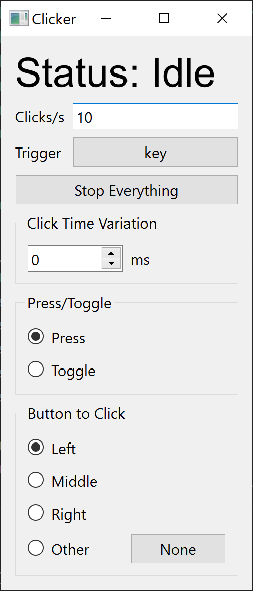

# Autoclicker
An autoclicker, but with optional random click delay

## Usage Guide
- **Status**: Shows whether the autoclicker is clicking or not
- **Trigger**: The key to press to activate the autoclicker
- **Stop Everything**: Clicking this button stops all clicking
- **Click Time Variation**: Varies the clicks per second with a uniform distribution
- **Press/Toggle**: Changes whether the autoclicker activates while the trigger is held down (press) or if the trigger is tapped (toggle)
- **Button to Click**: Changes what key is being clicked/pressed when the autoclicker is activated

